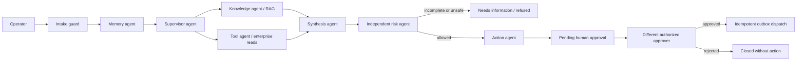

# PolicyFlow Agents

PolicyFlow Agents is a runnable, synthetic-only reference implementation of a governed
multi-agent workflow for insurance service operations. It retrieves approved guidance,
uses typed read-only enterprise tools, prepares a cited case brief, applies independent
risk controls, and stages an idempotent case-management action for human approval.

> Current boundary: this service uses synthetic records, an in-process workflow store,
> deterministic CI model and embedding doubles, and a simulated downstream connector.
> It is not connected to an insurer or authorized to adjudicate claims. The AWS profile
> is live and its deployment evidence is recorded below.

## What is implemented

- A real LangGraph workflow with distinct supervisor, knowledge, tool, synthesis, risk,
  and action responsibilities.
- Hybrid retrieval over approved tenant-visible English, French, and bilingual guidance,
  with access filtering before ranking and quarantined prompt-injection content excluded.
- A typed, allowlisted enterprise gateway for claim, policy, document-completeness, and
  simulated case-management operations. Direct identifiers never enter tool results.
- Scoped short-term memory keyed by tenant, user, and case, with redaction, bounded size,
  and an eight-hour TTL.
- Deterministic Responsible AI controls that prohibit autonomous claim adjudication,
  protected-attribute decisioning, self-approval, and action dispatch before approval.
- Reversible action staging, independent human approval, idempotent dispatch, and a
  hash-chained audit timeline.
- FastAPI contracts, Prometheus metrics, bilingual output, adversarial evaluation,
  container hardening, CI, PostgreSQL/pgvector SQL, and AKS/Key Vault deployment examples.
- A deployable AWS profile with ECR, ECS Fargate, CloudFront HTTPS, an Application Load
  Balancer, Secrets Manager, least-privilege IAM, CloudWatch logs/metrics/alarms, and
  GitHub Actions OIDC delivery.
- Provider ports for real embeddings (`BAAI/bge-small-en-v1.5`) and local generation
  (`google/flan-t5-small`) while CI stays deterministic, offline, and reproducible.

## Workflow



The planner cannot invent tools: it emits calls from a fixed registry, and tool arguments
are reconstructed from trusted graph state. The model cannot approve or dispatch an
action. Every consequential transition is enforced outside model output.

## Quick start

Python 3.12 is required.

```powershell
py -3.12 -m venv .venv
.\.venv\Scripts\python.exe -m pip install -e ".[dev]"
.\.venv\Scripts\python.exe -m uvicorn policyflow.app:app --reload --port 8010
```

Open `http://127.0.0.1:8010/docs`. The default headers create a synthetic operator in
tenant `NORTHSTAR_CA`. Use `X-Role: approver` with a different `X-Subject` for approval,
then `X-Role: service` for the simulated dispatch endpoint.

Docker is also supported:

```powershell
docker compose up --build
```

The container binds to `http://127.0.0.1:18010`, runs as UID 10001, drops all Linux
capabilities, uses a read-only filesystem, and has no live enterprise credentials.

## Verify

```powershell
.\.venv\Scripts\ruff.exe check .
.\.venv\Scripts\ruff.exe format --check .
.\.venv\Scripts\mypy.exe src
.\.venv\Scripts\python.exe -m pytest --cov=policyflow --cov-branch
.\.venv\Scripts\policyflow.exe evaluate
```

The frozen evaluation suite includes complete, incomplete, missing-case, French,
prompt-injection, and prohibited autonomous-decision scenarios. The deterministic judge
is deliberately identified as a CI policy judge, not represented as an LLM. An optional
local LLM-as-a-Judge adapter is available and is versioned separately from the system
model:

```powershell
.\.venv\Scripts\policyflow.exe evaluate --judge-backend transformers
```

## API surface

| Method and path | Purpose |
|---|---|
| `GET /health/live`, `GET /health/ready` | Process and local-profile health |
| `GET /api/v1/meta` | Explicit capability and non-capability boundary |
| `POST /api/v1/runs` | Execute the bounded multi-agent workflow |
| `GET /api/v1/runs/{id}` | Read a tenant-scoped workflow result |
| `POST /api/v1/runs/{id}/decision` | Record an independent approve/reject decision |
| `POST /api/v1/runs/{id}/dispatch` | Dispatch an approved action to the synthetic adapter |
| `GET /api/v1/runs/{id}/timeline` | Verify and read the hash-chained audit history |
| `GET /api/v1/graph` | Inspect the implemented LangGraph definition |
| `GET /metrics` | Prometheus metrics |

## Engineering documentation

- [Architecture](docs/ARCHITECTURE.md)
- [AWS architecture](docs/AWS_ARCHITECTURE.md)
- [AWS deployment, rollback, recovery, and cost guide](docs/AWS_OPERATIONS.md)
- [Verified AWS deployment evidence](docs/AWS_DEPLOYMENT_EVIDENCE.md)
- [Threat model](docs/THREAT_MODEL.md)
- [Production readiness and Azure fit-gap](docs/PRODUCTION_READINESS.md)
- [Enterprise agent capability matrix](docs/CAPABILITY_MATRIX.md)
- [PostgreSQL and pgvector schema](migrations/0001_initial.sql)
- [AKS deployment reference](deploy/k8s/workload.yaml)

## Defensible portfolio claim

For the included synthetic dataset and tests, PolicyFlow demonstrates a bounded
multi-agent service workflow with governed retrieval, allowlisted tools, scoped memory,
separation of duties, bilingual output, observable control points, and idempotent
human-approved action dispatch. Its verified AWS launch and evidence capture also support
the precise claim that you deployed a containerized FastAPI/LangGraph
service on ECS Fargate with HTTPS, monitoring, secrets, IAM, rollback, and GitHub Actions.
It remains portfolio evidence—not insurance production experience, business approval,
or proof of model quality.
