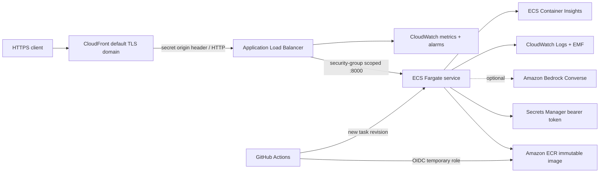

# AWS deployment architecture

Status: deployable CloudFormation reference; update this heading with the deployment date
and evidence link only after the live verification gate passes.

## Network and HTTPS

The stack creates a dedicated VPC and two public subnets. One 0.25-vCPU/0.5-GB Fargate
task receives a public IP so it can reach ECR, CloudWatch, Secrets Manager, and optional
Bedrock without a NAT Gateway. Its security group accepts port 8000 only from the ALB and
allows outbound TLS only.

CloudFront supplies the public `https://*.cloudfront.net` endpoint and redirects HTTP
viewers to HTTPS. The ALB listener is intentionally HTTP because TLS terminates at
CloudFront. Direct ALB traffic receives `403`; only requests with the generated CloudFront
origin header reach the target group. API caching is disabled, viewer `Host` and the
origin-verification header are excluded, and all other API inputs are forwarded.

This origin-header control prevents casual ALB bypass but is not WAF authentication.
Production expansion should add AWS WAF, a custom domain/certificate if required, private
subnets with selected VPC endpoints, and verified end-user OIDC instead of a shared bearer
token.

## Identity and secrets

- The execution role can pull only the PolicyFlow ECR repository, write only the service
  log group, and read only the generated runtime secret.
- The application task role has no AWS permissions unless Bedrock is enabled. In that
  case it can invoke only the named Nova 2 Lite inference profile and its foundation model.
- GitHub receives no AWS access keys. Its OIDC role trusts one exact immutable
  owner/repository ID subject and the `aws-production` environment, and can only push to
  this ECR repository, register task definitions, update this ECS service, and pass the two
  task roles to ECS.
- Secrets Manager injects the API bearer token directly into the task. The token is never
  written to task JSON, GitHub, deployment outputs, logs, or source.

## Delivery and rollback

Every main-branch deployment reruns lint, typing, tests, evaluation, and CloudFormation
lint. It builds a commit-SHA-tagged immutable image, requires the ECR scan to have no
critical findings, registers a new task revision, and waits for service stability. The ECS
deployment circuit breaker automatically rolls back tasks that do not reach steady state.
The workflow then performs a 60-request HTTPS load gate and retains the result as an
artifact.

See [AWS operations](AWS_OPERATIONS.md) for manual rollback and recovery.

