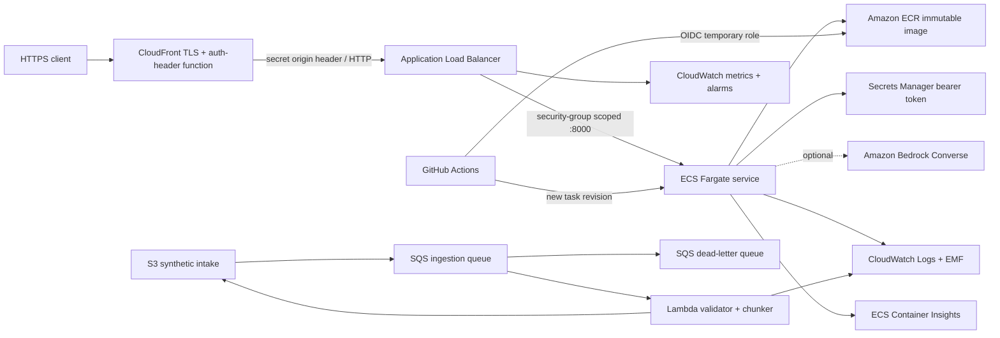

# AWS deployment architecture

Status: historically deployed and verified in `ca-central-1` on 2026-09-08, then
intentionally decommissioned after its evidence was preserved. The diagram documents the
validated deployment architecture; it does not represent currently running infrastructure.
See the [deployment evidence](AWS_DEPLOYMENT_EVIDENCE.md) and
[decommission verification](AWS_DECOMMISSION_PLAN.md).

## Network and HTTPS

When deployed, the stack creates a dedicated VPC and two public subnets. One
0.25-vCPU/0.5-GB Fargate
task receives a public IP so it can reach ECR, CloudWatch, Secrets Manager, and optional
Bedrock without a NAT Gateway. Its security group accepts port 8000 only from the ALB and
allows outbound TLS only.

CloudFront supplies the public `https://*.cloudfront.net` endpoint and redirects HTTP
viewers to HTTPS. The ALB listener is intentionally HTTP because TLS terminates at
CloudFront. Direct ALB traffic receives `403`; only requests with the generated CloudFront
origin header reach the target group. API caching is disabled. A viewer-request function
overwrites an internal forwarding header with the viewer's `Authorization` value, and a
small explicit allowlist forwards only that header plus required content, identity, and
correlation headers. The origin-verification header is never accepted from a viewer.

This origin-header control prevents casual ALB bypass but is not WAF authentication.
Production expansion should add AWS WAF, a custom domain/certificate if required, private
subnets with selected VPC endpoints, and verified end-user OIDC instead of a shared bearer
token.

## Operator and MCP surfaces

The same immutable image serves a React/TypeScript operator console at `/ui/`. It keeps
the bearer token in memory, renders tenant-filtered evidence and tool/agent activity, and
supports the existing separation-of-duties approval and dispatch flow. The MCP endpoint
at `/mcp/` uses stateless Streamable HTTP and exposes only `get_claim` and
`check_required_documents`. Authentication is enforced at the ASGI boundary; role,
tenant, tool allowlist, case-ID validation, and minimum-necessary output are enforced in
the tool boundary. The shared token is appropriate only to this bounded demonstrator;
production should use an OAuth/OIDC resource-server design with per-client scopes.

## Event-driven ingestion

The stack also provisions a private, versioned S3 bucket whose `incoming/*.json` events
flow through an encrypted SQS queue to a Lambda with event-source concurrency capped at
two. It validates,
chunks, content-addresses, and quarantine-tags synthetic content before writing a
manifest to `processed/`. Failed messages move to an encrypted DLQ after three receives.
The Lambda role is prefix- and queue-scoped, and CloudWatch covers logs, errors, queue
depth, and DLQ visibility. See [ingestion pipeline](INGESTION_PIPELINE.md).

## Identity and secrets

- The execution role can pull only the PolicyFlow ECR repository, write only the service
  log group, and read only the generated runtime secret.
- The application task role has no AWS permissions unless Bedrock is enabled. In that
  case it can invoke only the named Nova 2 Lite inference profile and its foundation model.
- GitHub receives no AWS access keys. Its OIDC role trusts one exact immutable
  owner/repository ID subject and the `aws-production` environment, and can only push to
  this ECR repository, register task definitions, update this ECS service, and pass the two
  task roles to ECS.
- Secrets Manager injects the API bearer token directly into the task. The token is never
  written to task JSON, GitHub, deployment outputs, logs, or source.

## Delivery and rollback

Every main-branch deployment reruns lint, typing, tests, evaluation, and CloudFormation
lint. It builds a commit-SHA-tagged immutable image, requires the ECR scan to have no
critical findings, registers a new task revision, and waits for service stability. The ECS
deployment circuit breaker automatically rolls back tasks that do not reach steady state.
The workflow then performs a 60-request HTTPS load gate and retains the result as an
artifact.

See [AWS operations](AWS_OPERATIONS.md) for manual rollback and recovery.
